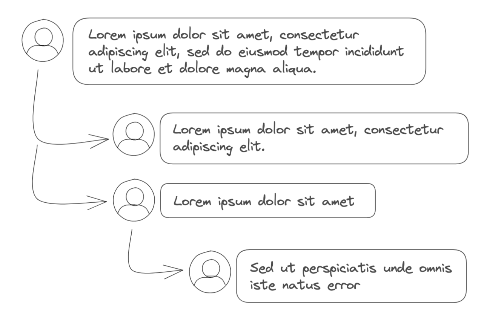
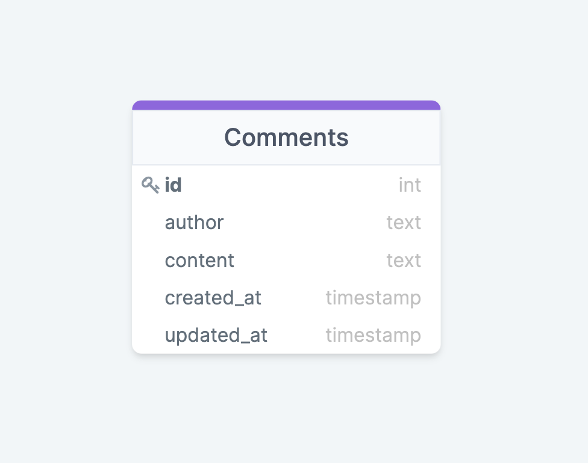
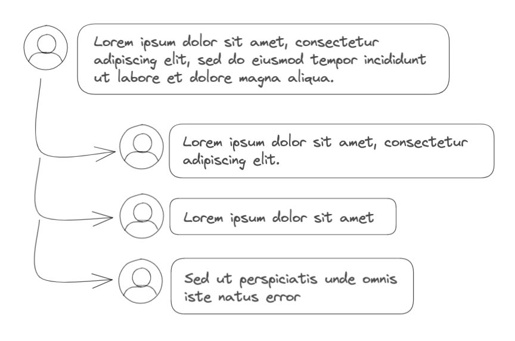
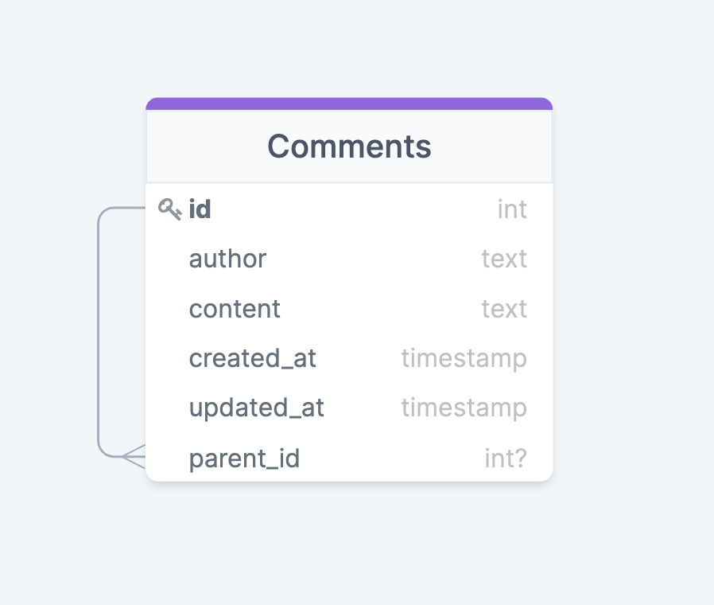
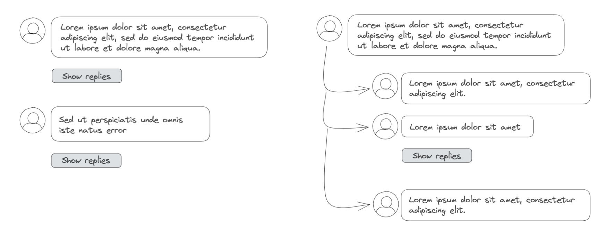
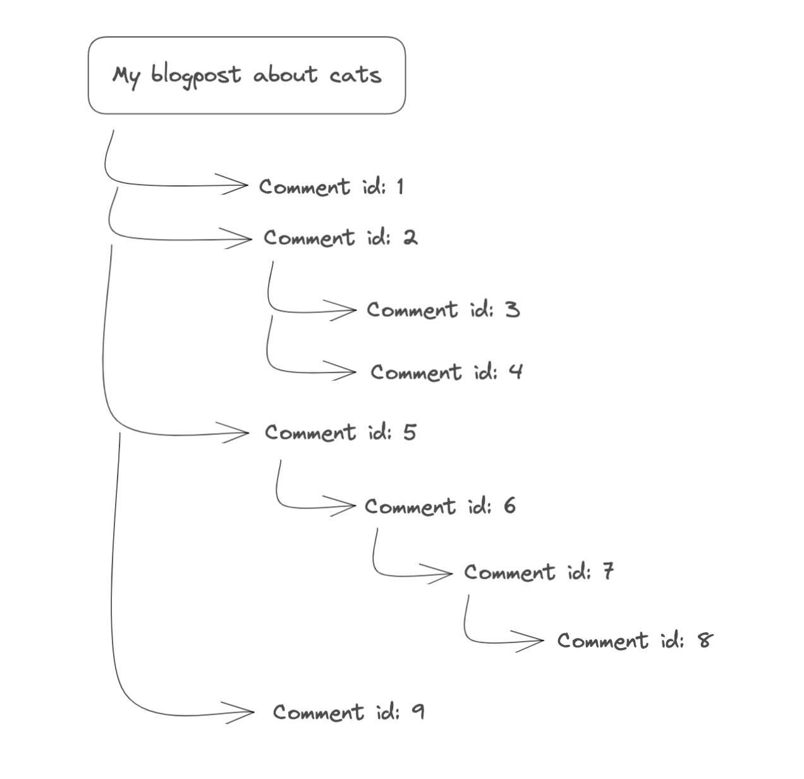
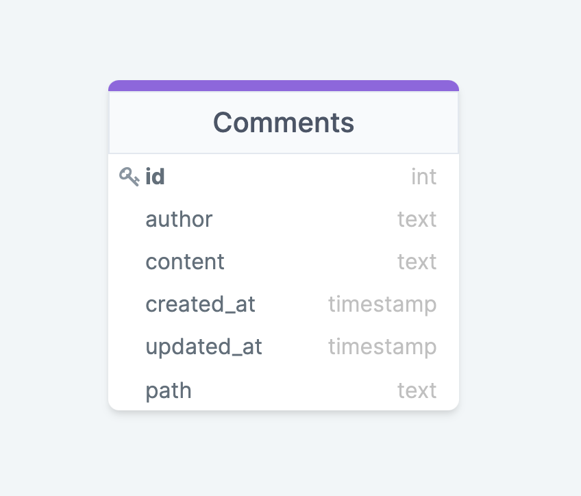

You're probably familiar with multi-level comments sections such as on Facebook, Reddit, or Hackernews — a user can reply to a post, and the system allows multiple levels of nested replies. I recently needed to implement it myself for a side project, and I found a few ways of modelling the database, with different complexities and tradeoffs. In this article, I'm going to cover a few of them. All the SQL examples will be in Postgres, but you can find substitute solutions in many other relational databases.



### Current schema

Let's say that this is the initial schema. There's a `Comments` table that stores whatever information we need. For the sake of example, I reduced it to just five columns.



## Comments with 1-level deep replies

Before diving into multi-level comments, I want to cover a more straightforward version — 1-level deep replies. In this case, each "base" comment can have multiple replies, but you can't respond to a reply.



We can extend the `Comments` table by adding a `parent_id` column to implement this scenario. The new column will have a foreign key relation to the Comment's id column. It'll be a many-to-one relation, which means a comment can have multiple comments (replies) that point to it as their parent.



What happens when a user replies to comment with id `1`? We add a new row, with `parent_id` equal to 1. Now, how do we fetch the comments? It's pretty flexible and depends on what you want to achieve in the UI.

- If you want to fetch only the "base" comments (not the replies), you can select everything from the `Comments` table where `parent_id` is NULL. You can then refetch the responses by selecting those entries that match a particular value in the `parent_id` column.

```sql
-- select base comments
SELECT * FROM "Comments" WHERE parent_id is NULL;

-- fetch replies to a comment
SELECT * FROM "Comments" WHERE parent_id = 'comment_id';
```

- However, if you want to fetch all the comments with the replies at once, you can do it with a little bit more complex SQL query. There are many ways to fetch this data, and it mostly depends on what shape you want on the front end. For example, to have replies as an object, you can do something like this in Postgres:

```sql
SELECT
	c.*,
	replies
FROM
	"Comments" c
	LEFT JOIN (
		SELECT
			parent_id,
			COALESCE(json_agg(row_to_json(replies)), '[]'::JSON) AS replies
		FROM
			"Comments" AS replies
		GROUP BY
			parent_id) AS replies ON c.id = replies.parent_id
WHERE
	c.parent_id IS NULL;
```

If you use GraphQL it could look like this:

```graphql
{
  comments(where: { parent_id: { _is_null: true } }) {
    content
    created_at
    id
    replies: comments {
      content
      author
    }
  }
}
```

This was one of the ways to have 1-level deep replies, and I'll stop here to move the main topic of this article — multi-level replies.

## Multi-level replies

Choosing the suitable data model and implementation depends not only on the ease of the backend implementation but also on the frontend. How exactly the comments are shown on the UI can influence the DB model decisions. Let's say the design states that we don't need all the nested replies at once but instead have a `show replies` button. In this case, maybe we can use a different backend implementation than when we need all the nested comments and responses at once. After all, the `show replies` approach is quite common (Facebook), and maybe it'll be the case for your app as well? Let's consider this approach first.

### Without fetching the replies at once



We already mentioned refetching the replies for a particular comment when discussing the 1-level comments. This scenario is not much different but can have multiple approaches:

1. We fetch only the base comments and have a show replies button below each. After a user clicks the `show replies` button, we fetch the replies and show `show replies` for each. And then it can be as nested as you want. You can use the same queries as we mentioned earlier.

2. We can also bring a bit more data at first — the base comments and 1-level replies, and then we have a button below each reply.

3. We fetch the base comments and a maximum of one reply to each, with the `show more` button to get all the replies. It can also happen on a more nested level.

The takeaway here is that it's all possible with a simple database model having a self-referencing table, and we can fetch the data with a few short queries. However, it's not always enough, and in case you need all the nested replies, it's getting a bit more complicated. In the following sections, I'm going to cover two, in my opinion, quite nice ways to deal with it.

### Using a common recursive expression

Common table expressions allow you to create a helper query that you can use in the main query. You can think of it as a temporary table to use within a SELECT, INSERT, UPDATE, or DELETE statement. Here's an example:

```sql
WITH cte_replies AS (
	SELECT
		parent_id,
		COALESCE(json_agg(row_to_json(replies)),
			'[]'::JSON) AS replies
	FROM
		"Comments" AS replies
	GROUP BY
		parent_id
)
SELECT
	*
FROM
	"Comments" c
	LEFT JOIN cte_replies ON c.id = cte_replies.parent_id
WHERE
	c.parent_id IS NULL;
```

It's the same query we used before for getting comments and replies but written using a common table expression.

Now, a recursive commont table expression can reference itself, which is helpful when querying hierarchical data, e.g. nested comments!

#### How we're going to use it?



Take a look at the diagram above. _My blogpost about cats_ has four base comments (id: 1, 2, 5, 9), the second one has two replies (id: 3, 4), and the third comment has 3-level deep replies. Let's say we want to fetch the comments and all of their replies. The tricky part here is calculating the hierarchies. It sounds like a lot of mapping through the list to obtain the comments tree as an object. That's when a recursive table expression can help. We can construct a query to get results with the hierarchy collected as a path. The base comment will have an empty path as it doesn't have a parent, and the replies will have it constructed from the previous comments' ids. For example, from data as on the above diagram, comment number 8 would have a path of value `/5/6/7`.

```sql
WITH RECURSIVE comments_cte (
	id,
	path,
	content,
	author
) AS (
	SELECT
		id,
		'',
		content,
		author
	FROM
		"Comments"
	WHERE
		parent_id IS NULL
	UNION ALL
	SELECT
		r.id,
		concat(path, '/', r.parent_id),
		r.content,
		r.author
	FROM
		"Comments" r
		JOIN comments_cte ON comments_cte.id = r.parent_id
)
SELECT
	*
FROM
	comments_cte;
```

Now imagine that you have pagination and need only _**ten** comments and all of their replies_. The tricky part here is to know which comment you should select that are replies (or nested) to the ten comments you need. The approach with a recursive CTE helps a bit with calculating the hierarchies. Still, it's pretty complex in terms of database performance as well as extendability. It can get out of hand when adding pagination on top of that. That's the way I'm going to show another approach that may solve this problem.

### Using an additional `path` column

Since we already spoke about paths as a helper to know about hierarchies, we can think about another solution that doesn't require heavy SQL calculations. We can modify the schema by removing the foreign key relation and adding a new `path` column.



New schema means we need to change the way of adding new comments to the database. When inserting a new row, we need to pass a calculated path. It should be pretty straightforward if you have the information to which comment a user is replying and the hierarchy on the front end.

Regarding fetching the comments, you can query all of the entries if you need all of them. However, if you need pagination, this solution can be a good fit. Let's say you select ten "base" comments per page and all the nested replies of these ten comments. In such a case, the query should select ten entries with an empty path and all entries where the path starts with the selected base comments.

```sql
WITH base_comments AS (
	SELECT
		*
	FROM
		"Comments"
	WHERE
		path IS NULL
	LIMIT 10 -- optional
	OFFSET 0 -- optional
) (
	SELECT
		*
	FROM
		"Comments" replies
	WHERE
		replies.path ~ ANY (
			SELECT
				id
			FROM
				base_comments))
	UNION ALL
	SELECT
		*
	FROM
		base_comments;
```

I used a CTE again in this query mostly because I like using it 😅, but you can manage perfectly well without it!

### Using ltree

If you're using Postgres, you might be interested in checking out a [ltree](https://www.postgresql.org/docs/9.1/ltree.html) data type. It represents labels of data stored in a hierarchical tree-like structure. Postgres provides many ltree operators to search through the hierarchical data, for example, searching for ancestors or descendants.

A ltree's label is a sequence of alphanumeric characters and underscores less than 256 bytes long. A label path is a sequence of labels separated by dots, e.g. `1.2.3`.

To use this data type, we need to add an extension to Postgres and create a new column:

```sql
CREATE EXTENSION IF NOT EXISTS ltree;

ALTER TABLE "Comments" ADD COLUMN path ltree;
```

We can then use a `<@` operator to get all nested replies of a particular comment:

```sql
SELECT * FROM "Comments" WHERE path <@ 'comment_id';
```

[Here](https://www.cybertec-postgresql.com/en/postgresql-ltree-vs-with-recursive/) you can read more about a comparison between a recursive CTE and ltree.

## Summary

As I mentioned before, choosing a suitable model depends on many things — each application has different requirements and cares about different things. In this article, I only showed a few options that I've been looking at myself recently. However, other ways of handling multi-level comments may be a much better option in your particular use cases. Maybe a bridge table storing all the relations is a right fit for your app? Or perhaps you don't use a relational database and have a totally different way of dealing with this problem? Choosing the right solution also depends on your current database and its supported features (good luck with working with jsons in MS SQL server).
