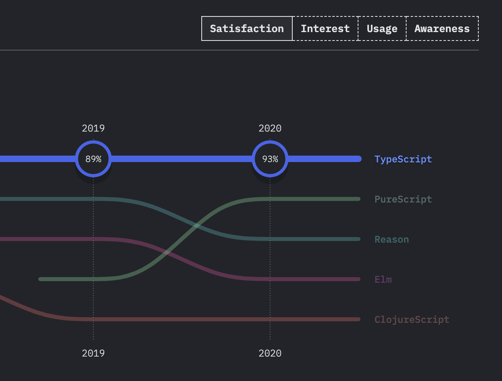

TypeScript is only becoming more popular. The [State Of JS](https://2020.stateofjs.com/en-US/) survey confirmed that recently. More people want to learn it, and more projects start in TypeScript. It's kind of mainstream now. I guess at this point most of us know that there what are the benefits of using TypeScript, and that in general, it may be a good idea to choose it over JavaScript. In many cases. However, the problem is how we're using it.

<div style="display: flex; justify-content: center">
<div style="text-align: center; width: 500px">
  
  Source: <a style="color: #1A936F; border-bottom: 2px #1A936F solid;" href="https://2020.stateofjs.com/en-US/technologies/javascript-flavors/">State of JS</a>
</div>
</div>

I see too many people coming from the JavaScript world, adopting this kind of thinking: "so I need to write JAVASCRIPT, and then FIX my code by adding types". Well, that works too. You'll still see some great benefits *AFTER* you're done with writing code. However, I'd like to show you that there's more to TypeScript.

So what's wrong with *AFTER* writing code benefits? Nothing per see. The problem is that we miss out plenty of nice things we could have *DURING* writing the code and get the most out of it.

Yet, it's not apparent how to do so. It's relatively easy to find yourself fighting with TypeScript. Constantly fixing compiler error. Struggling with how to type the code you just wrote. Working around the compiler. Whereas It could be different. We could take the full advantage of it. Writing code in TypeScript is supposed to make our lives easier. Not to feel like a burden.

Suppose someone is used to writing JavaScript. They have a lot of experience in it, and TypeScript doesn't feel that comfortable yet. Let's call this person Bob. Bob is about to implement a new feature. So they're going to write a new code in good 'ol JavaScript, and, worry about adding types at the end. Sometime later the task is done. It's time to convert it to TypeScript. The problem is, it may feel a bit like a fight. Everything is red in the editor, compiler shouts. "TypeScript, please, shut up".
After some time, all compiler errors are fixed, types are added (including a lot of `any`, because things turned out to be hard to type), and it seems like the job is done. And yeah, it is done. Code is typed. But could Bob get more benefits out of TypeScript? Yes!


**They could have taken full advantage of TypeScript. By actually writing TypeScript from the very beginning.**

TypeScript is a statically typed language. And even though TypeScript is a gradually statically typed language and you decide how much of staticness you want, it differs significantly from JavaScript. Static typing makes us think differently. At least a bit. It makes us think more about modelling data, designing APIs, and making things "click together". If you start writing code with types in mind, you're more likely to type things better. Better than when adding types to the existing code. You'll think more about design details. If something is hard to type, maybe it wasn't designed well? Or if it is hard to type, won't it be hard to grasp for your colleagues? It's the same deal as with tests. If something is hard to be tested — it's likely to be challenging to maintain and extend. 

It may feel faster to write code in JS. Especially when you're not that familiar with TypeScript. But when you know that your code needs to end up being in TypeScript, "Write JS then convert to TS" is not a way to go. Why? Because then you don't *think in TypeScript*. You won't model your code with types to be straightforward and easy to maintain. You won't spot lousy designs quickly.

Another thing. TypeScript is a different language. You can't write everything in TypeScript that you would in JavaScript. And if you write code that is not valid TypeScript, you'll need to work hard to go around the compiler. It will most likely result in lousy types. Consider the following example:

```ts
const items = [1,2,3,4];

const foo = (x: number[]) => console.log(x);

const bar = () => {
    const x = [1];

    if (items[x]) { // ❌
        console.log(items[x]); // ❌
    }

    foo(x);
}

bar();
```

JavaScript will let you write it without any complaints. TypeScript won't. In TypeScript, you'll see an error: **Type 'number[]' cannot be used as an index type.(2538)**. And when you'll see this error you will start to think what this code is doing. Why am I getting an error? Maybe I did something weird in this code? *Oh shit, I'm making an assumption that I'll always have single-element array!*

There are also plenty of other benefits that you can get designing with types. If you want to know more about it, check out the excellent post series on [F# for Fun and Profit](https://fsharpforfunandprofit.com/posts/designing-with-types-intro/).

Yet, I'm not trying to evangelize type-driver development here. (Though, it's great, try it out!) My point is that you can make TypeScript work for you DURING writing code. Don't think about TypeScript as "oh no, I have to add those stupid types".
Don't think of it as a fight with compiler errors. Think about the process. Process of writing code. Embrace it from the start. Because eventually, writing types and writing runtime code simultaneously, rather than leaving it for later, will make you change the perspective and write more robust and less complicated code.

