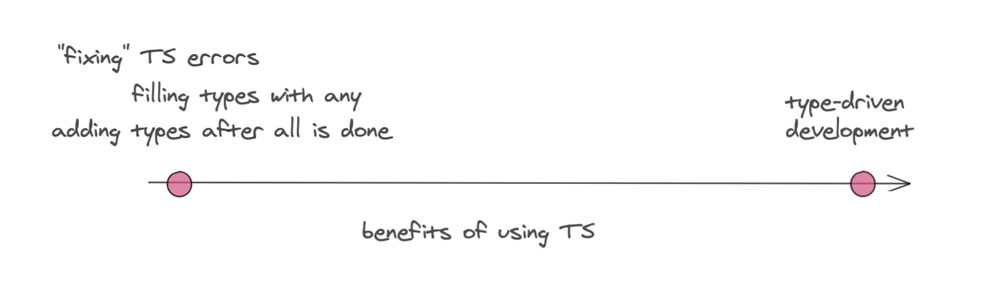

<!-- Tak samo jak ludzie piszą kod a potem naprawiają testy -->

TypeScript is only becoming more popular. More people want to learn it, and more projects start in TypeScript. Many people decide to use it over JavaScript. However, the problem is *how* we're using it.

Most people come to TypeScript from JavaScript. For some, static typing is something new. Thus TypeScript seems like a completely new language to learn. That's fair. There are a few things to learn. It takes some time before one is confident with writing TypeScript types, and plain JavaScript may seem far more comfortable. But... they said we can write JavaScript in TypeScript, isn't that right? Yes, it is! However, it may lead to a kind of a trap. The trap being this thinking:
"so I need to write JAVASCRIPT, and then FIX my code by adding types".

There is a wide spectrum of what TypeScript can give you. On the one side of this spectrum, we have the above thing: writing good old JavaScript, without TypeScript types, or filling the gaps with any, and after the implementation is done — fixing the types. On the other side of the spectrum, we have type-driven development.

<div style="display: flex; justify-content: center; width: 100%">
  <div style="text-align: center; width: 800px">
    
  </div>
</div>

With this article, I do not want to say that type-driven development is superior and the only way to go about writing code. I want to show you that being on the "fixing typescript" side of the spectrum won't allow you to get the most out of TypeScript, and that you may want to go a bit more to the other side.

But let's make one thing clear — even if you write your code in JS, without types (or annotating everything as any), and then add types, it's not like TypeScript is useless. It's not like you won't have `any` (heh) TypeScript benefits. It will still allow you to maintain your code easier, make refactorings faster, prevent you from some embarrassing errors in your client's browser. However, there's more to TypeScript. And do we want to settle for less?

So what's wrong with _fixing your code by adding types to JS_?

---

<!-- JavaScript is a dynamicaly typed language, whereas TypeScript is statically typed, and there is a subtle (or not so subtle?) difference in mindset you have when coding in dynamically and statically typed languages. There are things you don't think about then coding in the former, which the latter would force you to think about. There can be a lot of mutability going on, which makes it hard to provide a type for a variable if it can have multiple shapes of data — it's easier to say it's `any`. In many cases you need to guess types as many days can pass between the start of developemnt and the end (time of adding types). Even if you wrote this code, you may not remember all the details such as _this argument can only be particular string values_. -->


### You don't narrow types

The implementation is done, you did a demo for your team, your project manager thinks you can move on to another task. There's not much time to add types. There's defienitely not enough time to analyze every function, every variable, and add proper, narrowed types. Even if something _seems_ obvious or straghtforward, it is easy to miss it, especially under a pressure.

Example:
```ts
const download = (format: string, data: DataObject) => {
  if (format === "JSON") {
    // handle JSON format
  } else if (format === "CSV") {
    // handle CSV format
  }
}
```
This could be `format: "JSON" | "CSV"`, right? However `string` does work, and maybe the function was huge and there was no time to go through the implementation to get the proper type? It bet it'd be less likely to happen if types were added before or during or even right after implementing the `download` function when the idea of what this function does is still in your head.

Another example:
```ts
const handleResponse = (res: ?) => {
  if (res.error) {
    // handle res.error
  }

  if (res.data) {
    // handle res.data
  }
}
```
`res` can have `error` or `data`, and both fields can be falsy. Quick solution:
```
{data?: number, error:? string}
```
Does it work? It does. Can we do better? Yes! We had more information about the `res` shape (that we forgot when adding types days later). We know that it can be either an object with `data` property or an object with `error` string. So we could include this knowledge it the type:
```
{data: number, error?: undefined} | {error: string, data?: undefined}
```

Disclaimer: costam znak zapytania bo js a ni klucz in res

### You settle for any

Highly dynamic code. Mutability. Complex shapes of objects. Who has patience to annotate all of it? We could say `any` and call it a day. Tempting, right? Now imagine sititng down to implement a function. There's no code yet. You're about to write type signature of the function. Would you be like _shit, in a few hours this will be a super complex function, so I better annotate everything as any_. I bet not. Even if you're about to write a complex function (and let's say it's by design), you would come up with something better than `any`. The idea of the funcion is fresh in your head, you know what kind of data will flow through it. It's the best time to add types and make them work for you when implementing the body; not when you're tired, overwhelmed with the implementation details, and want to move on to another thing.

### You won't spot lousy code soon enough

Undoubtedly, you're familiar with the notion that if something is hard to test, it will be hard to maintain. It's the same deal with types.
If something is hard to describe in a statically typed language, won't it be hard to grasp for your colleagues and the future you? TypeScript may help you rule out bad designs faster. When you're focused on types without being distracted by the implementation, you can consider multiple ideas, multiple ways of typing something that will then influence the implementation. You can keep asking yourself these questions:
1. Does one alternative has simpler types than another?
2. Does one alternative enable more efficient implementation than another?

### You're missing out help in coding

TODO
<!-- if you don't yet know how to implement thing, code will naturally emerge between those types.
typy pozwolaja zoomowac sie w przestrzzeni wszystkich mozliwych programow 
2. during testing and coding, easier to fix problems -- as a result types will improve over the course of development
3. jak dane przeplywaja -- jak dane sie zmieniaja, jak kształ sie zmienia, jak stany sie zmieniaja  -->

### TypeScript is not exactly _JavaScript + types_

In practice, when you write TypeScript, you’re writing JavaScript, but restricted to the subset that's conventional in TypeScript, which may differ from the JavaScript you used to.

<div style="display: flex; justify-content: center; width: 100%">
  <div style="text-align: center; width: 800px">
    
  </div>
</div>

TypeScript is a superset of JavaScript, but many things that pass in JS will cause a TypeScript compiler error.

An example:

```ts
const items = [1,2,3,4];

const foo = (x: number[]) => console.log(x);

const bar = () => {
    const x = [1];

    if (items[x]) { // ❌
        console.log(items[x]); // ❌
    }

    foo(x);
}

bar();
```

JavaScript will let you write it without any complaints. TypeScript won't: you'll see an error (`Type 'number[]' cannot be used as an index type.(2538)`). It could be worked around with `any` or type assertions, but does this implementation even make sense? Shouldn't we change it before hacking around over assumptions that are legal in one langauge and illegal in another? Would we end up with this code if we added types from the get-go?

### You're less likely to use some TypeScript's features

For example — union exhaustiveness checking. Usually adding types after writing code is what it is — just adding types. The feature is working, tests are passing, we're not touching the implementation.

Let's take this switch statement:
```ts
const getStatus = (status) {
  switch (status) {
    case "loading":
      return "Loading...";
    case "request":
      return "Requesting..."
    case "error":
      return "Error";
    case "success":
      return "Success!";
    default:
      return '';
  }
}
```
You know that `status` can be of those four values: `loading, request, success, error`, and there shouldn't be any other value. It would be enough to add those types:
```ts
type Status = "loading" | "request" | "success" | "error";
const getStatus = (status: Status): string {
  switch (status) {
    case "loading":
      return "Loading...";
    case "request":
      return "Requesting..."
    case "error":
      return "Error";
    case "success":
      return "Success!";
    default:
      return '';
  }
}
```
It's working! But hey, every time we extend `Status` union, we need to remember about handling it in `getStatus` function. Wouldn't it be better to have TypeScript remembering it for us by using [union exhaustiveness checking](https://www.typescriptlang.org/docs/handbook/unions-and-intersections.html#union-exhaustiveness-checking)?

---

### Cool, but how do I actually do this?

It's all better said than done, I know. The idea of static typing may be somewhat strange and I get that it takes time to be fairly confident with it. Take small steps and you'll get more comfortable with TypeScript in no time.

## Summary

Static typing makes us think differently. It makes us think more about modelling data, designing APIs, and making things "click together".

My point with this article is that you can make TypeScript work for you as early as possible. Don't think about TypeScript as _oh no, I have to add those stupid types_. Don't think of it as a fight with compiler errors. Think about types as of the integral part of your code. Eventually, writing types and writing runtime code simultaneously will make you change the perspective and write more robust and less complicated code.

---

### Further reading

1. There are many benefits of designing with types. If you want to know more about it, check out the excellent post series on [F# for Fun and Profit](https://fsharpforfunandprofit.com/posts/designing-with-types-intro/).

2. [Tests or Types: Why Not Both?](https://www.swyx.io/tests-or-types/).


