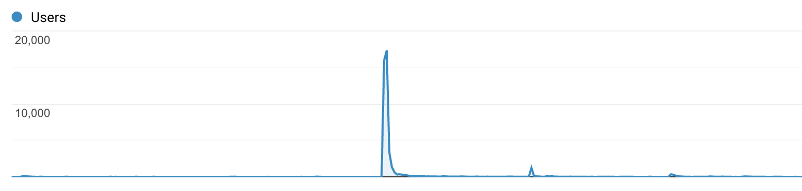
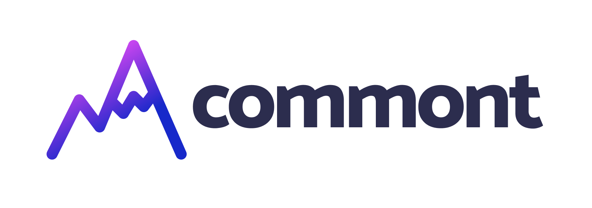

When I first started writing blog posts (on Medium), I mostly did it for myself back when studying computer science. Writing about something was the best way to learn or make myself get started on a project. I remember failing a class and re-learning from my blogpost the next year — the best feeling ever (though if I failed, does it mean it wasn't that good?). Anyway, I migrated to my blog website at some point, but I was almost sure no one is reading it (I mean, google analytics kind of confirmed 😅). At some point, my blog peaked:

  

    
  

And since then, I have had some traffic (I know it looks kind of flat, but there _are_ some views). People would reach out to me on Twitter or Linked In about a blog post, so I thought I should add comments to my blog! That's when it started.

I did some research, and I came to realise that I hate all the existing solutions. I needed my own.

Oh, I first wanted reactions to blog posts, so I created https://animated-emojis.netlify.app/readme. (That's how the story with reactions started, and that's how it ended).

Anyway, around a year ago, I built a small side project (while on vacation 🙄): https://github.com/beerose/use-comments and joked about making a SaaS out of it.

<blockquote class="twitter-tweet">
I told myself that I&#39;d make a SaaS out of that if I get 100 stars.  Shit. <a href="https://t.co/dfslwrPOOQ">pic.twitter.com/dfslwrPOOQ</a>
&mdash; Aleksandra Sikora (@aleksandrasays) <a href="https://twitter.com/aleksandrasays/status/1336657594618957824?ref_src=twsrc%5Etfw">December 9, 2020</a></blockquote> 

(You can guess — I didn't mean it.)

However, a few months later, being burnt out and looking for an easy and quick side project, I thought that:
I never built a SaaS, so that can be a nice learning opportunity,
It's relatively small, so I can pull it off by working a few hours a week on that,
Some people actually used the self-hosted version, so I also _almost_ believed that it makes sense to build a SaaS.

<blockquote class="twitter-tweet">
Last week I decided that I can actually do this.   Tracking my progress here: <a href="https://t.co/OyGPgUmfdq">https://t.co/OyGPgUmfdq</a> for some accountability.   My stack is: - <a href="https://twitter.com/blitz_js?ref_src=twsrc%5Etfw">@blitz_js</a>  - <a href="https://twitter.com/tailwindcss?ref_src=twsrc%5Etfw">@tailwindcss</a>  - <a href="https://twitter.com/prisma?ref_src=twsrc%5Etfw">@prisma</a>  - <a href="https://twitter.com/heroku?ref_src=twsrc%5Etfw">@heroku</a> <a href="https://t.co/a1bmMMRXBz">https://t.co/a1bmMMRXBz</a>
&mdash; Aleksandra Sikora (@aleksandrasays) <a href="https://twitter.com/aleksandrasays/status/1382793677110657031?ref_src=twsrc%5Etfw">April 15, 2021</a></blockquote> 

Hence sometime in the middle of 2021, I started working on it. I just moved to Italy for some time and had a new dose of energy. It was going GREAT. I have been writing down my progress for a while here: https://gist.github.com/beerose/f1091d72b61e788122b33743a67ac670.
A few weeks later, two things happened:
Life. I had a lot of back and forth driving Poland — Italy, which was exhausting.
I ran out of "exciting" things to implement and was left with all those "boring" ones as copywriting, improving styles, some minor features, etc. Meh.

Hence I took a break for a few months. I only picked it up again after leaving my full-time job. I wanted to have a few weeks when I can do whatever I want and, surprisingly, I actually felt like finishing it.

### The hardest part

(This will be anti-marketing, so I hope people interested in paying me for that won't read it 😅).

As I mentioned before, I was joking when I first said the SaaS idea. That's one reason why I was never too serious about releasing it. I wanted to build it, yes, but releasing? Who would even want it?
That brings me to another problem — impostor syndrome. Confidence was never my strong point, but building a product on my own, was like omg, who would even want it from me. I don't want to hide behind being a woman in tech, but having anti-support from your male friends makes you think that you absolutely can't fail. Not only it's some small, kind of silly (common, it's comments) side project; it's also who builds it matters. Hence I did not only feel pressure from "omg, she's building such a tiny, easy thing because that's all she can do as a woman", but also from what if I fail when building "a tiny, easy thing because that's all I can do as a woman".

To evaluate this kind of pressure, I tried to focus on learning. After all, I never built a SaaS. I never had to take care of privacy policies (I still didn't, it turns out there are other SaaS products for that), configuring payments, taxes, and many more.

And that was fun. And that was why I could work on it during my time off work.

Oh, and one more thing — you probably wonder where's the name and logo coming from. As I said before — I just moved to Italy when I started working on it, specifically to the north of Italy. I wanted to go there to hike the Dolomites (I didn't, but that's another story). So Commont is a comment + mont (mountain). And... the logo is supposed to present mountains and pencils (writing process) 😅

  

    
  

